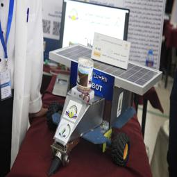
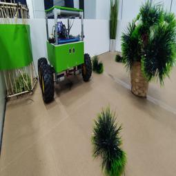
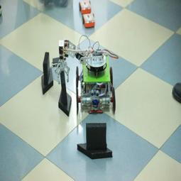
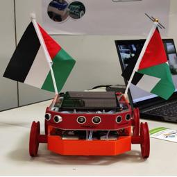
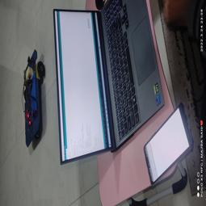
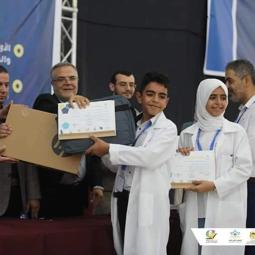
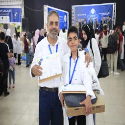
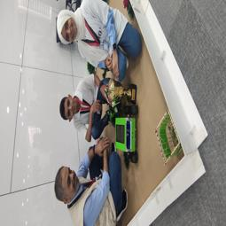
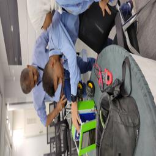
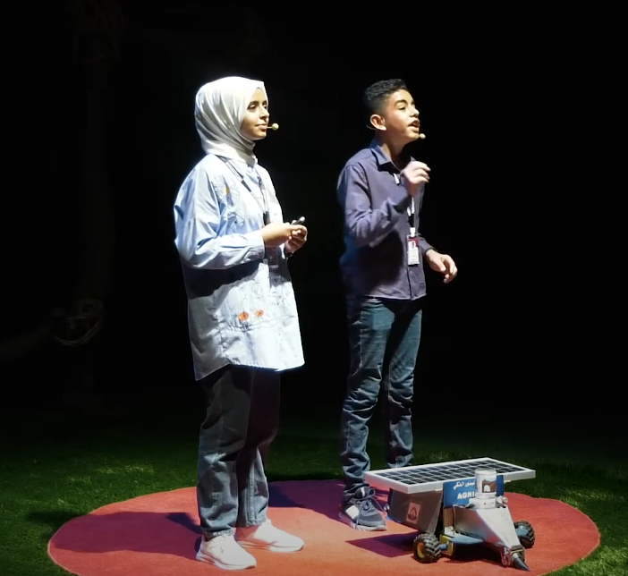

# 🌟 Welcome to My GitHub Profile! 🌟

## 👨‍💻 About Me

Hi there! I'm **Ibrahim abu al roos**, a passionate programmer, innovator, and tech enthusiast. At just 15 years old, I have developed a solid foundation in various programming and technical fields.  

**What do I offer?**
- Building web applications with **Django** and **Flask**.
- Designing desktop applications using **Tkinter**.
- Creating simple games with **Pygame**.
- Working with camera systems using **OpenCV**.
- Proficient in working with **REST APIs**.
## ⚙️ Technical Skills
### Built advanced robots using **Arduino** and **ESP32**.
Expertise in repairing and designing electronic circuits.

## Robots

### 🖥️ Programming

  

  
  
  
  
  
  
  
  
  
  
  
  
  
  
  
  

### 📚 Frameworks & Libraries

  
  
  
  
  
  
  
  
  
  
  
  

### 🔧 Electronics

  
  
  
  

### 🔄 distributed version control system

  
  
  
  

### 📑 editor

  
  

## 🏆 Achievements 

<!--  -->
### **Scientific and Technical Exhibition**: Achieved **1st Place** and the Grand Prize.

<!-- [img4](image11_resized_255x255.jpg) -->
### **WRO Local Competition**: Secured **1st Place** at the national level in Palestine.

<!-- [img4](image5_resized_255x255.jpg)-->
### **WRO International Competition**: Ranked **9th Globally** in Germany.

### **[TEDx Speaker](https://www.youtube.com/watch?v=hQ-MoyboAKo)**: Presented my ideas to a global audience.

## 📂 Highlighted Projects

### 🌐 Web Applications
 - **[IMDB](https://github.com/ibrahim-sisar/IMDB)**: Search for movie information useing **(flask)**.
<!-- - **[Project Name 2](project-link)**: A brief description of the project. -->

### 🖥️ Desktop Applications
- **[python markt](https://github.com/ibrahim-sisar/python-markt)**: A desktop application built with Tkinter.

### 🤖 Robotics
- **[Agrebot](https://www.youtube.com/watch?v=VuprfWUG2-A&t=2s)**: A demonstration of an intelligent robot built using Arduino or ESP32.  
  *(Check out the video to see it in action!)*

---

## 📈 Vision for the Future

I aim to become a professional developer specializing in cutting-edge technologies like Artificial Intelligence, Internet of Things (IoT), and system automation.

---

## 🤝 Let's Connect!

- **Email**: [ibrahim.sisar@gmail.com](ibrahim.sisar@gmail.com)
- **GitHub**: [https://github.com/ibrahim-sisar](https://github.com/ibrahim-sisar)

---

> 💡 "Continuous learning is the key to success."  
> **Feel free to reach out for collaboration, sharing ideas, or exploring new opportunities!**
---

